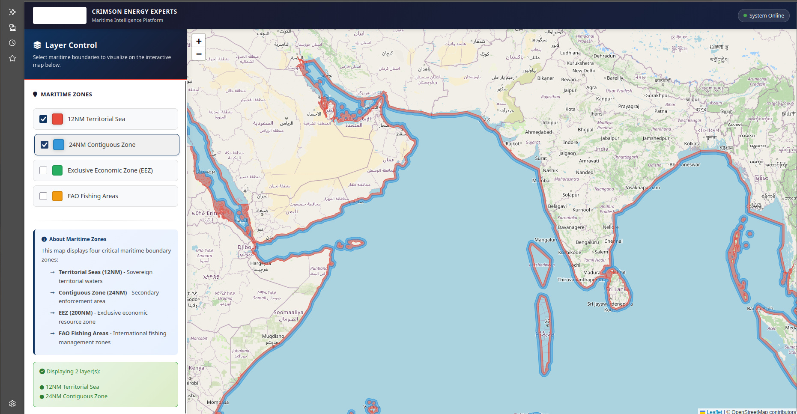
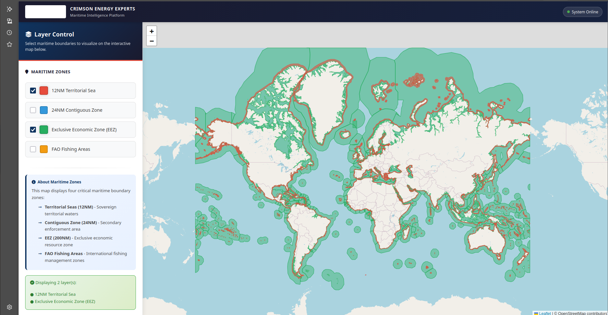
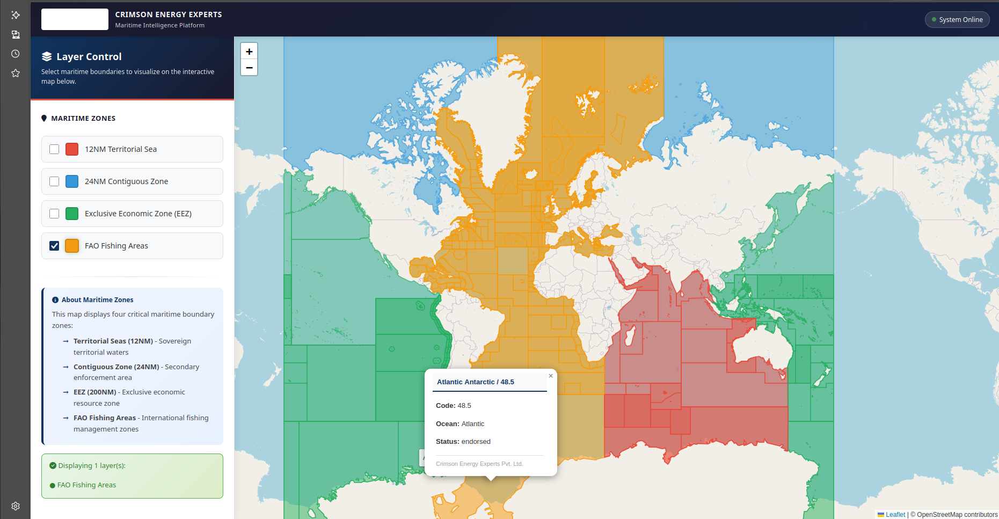

# 🌊 CEE World Maritime Region Visualization

A comprehensive interactive visualization system for exploring global maritime boundaries, including Exclusive Economic Zones (EEZ), Territorial Seas, Contiguous Zones, and FAO Fishing Areas.



## 📋 Table of Contents

- [Overview](#overview)
- [Features](#features)
- [Quick Start](#quick-start)
- [Installation](#installation)
- [Usage Guide](#usage-guide)
- [Visual Demonstration](#visual-demonstration)
- [Project Structure](#project-structure)
- [Maritime Layers](#maritime-layers)
- [Technical Details](#technical-details)
- [Troubleshooting](#troubleshooting)
- [Contributing](#contributing)
- [License](#license)

## 🎯 Overview

This project provides an interactive web-based visualization tool for exploring multiple maritime boundary layers simultaneously. Built with modern web technologies and Python, it allows users to:

- **Toggle multiple maritime boundary layers** on/off in real-time
- **Explore detailed information** by clicking on any maritime zone
- **Compare different boundary types** side-by-side
- **Export interactive maps** for sharing or embedding

The system uses an object-oriented architecture that makes it easy to extend with new maritime boundary types or customize visualization styles.

## ✨ Features

### Interactive Layer Control
- ✅ Real-time layer toggling with instant map updates
- ✅ Multiple layers can be displayed simultaneously
- ✅ Beautiful, intuitive checkbox interface
- ✅ Color-coded layers for easy identification

### Comprehensive Maritime Data
- ✅ **12 Nautical Miles Territorial Sea** - 230 zones worldwide
- ✅ **24 Nautical Miles Contiguous Zone** - 220 zones worldwide
- ✅ **Exclusive Economic Zone (EEZ)** - 285 zones covering 140.8M km²
- ✅ **FAO Fishing Areas** - 370 areas organized by ocean regions

### Rich Information Display
- ✅ Click any zone to see detailed popup information
- ✅ Territory names, sovereign states, and area statistics
- ✅ FAO area codes, ocean classifications, and status information
- ✅ Responsive design works on desktop and mobile devices

### Performance Optimized
- ✅ Geometry simplification for faster loading
- ✅ GeoJSON format for efficient web delivery
- ✅ Lazy loading of layers
- ✅ Optimized rendering pipeline

## 🚀 Quick Start

### Prerequisites

- Python 3.8+ installed
- Modern web browser (Chrome, Firefox, Safari, or Edge)
- Git (for cloning the repository)

### Option 1: Using Startup Scripts (Recommended)

#### Linux / macOS:
```bash
cd /path/to/Fishing_areas
chmod +x start_server.sh
./start_server.sh
```

#### Windows:
```bash
cd \path\to\Fishing_areas
start_server.bat
```

Then open your browser to: **http://localhost:8000/maritime_interactive_map.html**

### Option 2: Manual Server Setup

```bash
cd /path/to/Fishing_areas
python3 -m http.server 8000
```

Then navigate to: **http://localhost:8000/maritime_interactive_map.html**

### Option 3: Using Jupyter Notebooks

For interactive exploration with Python:

```bash
jupyter notebook maritime_interactive_explorer.ipynb
```

Or:

```bash
jupyter notebook maritime_single_map_explorer.ipynb
```

## 📦 Installation

### 1. Clone the Repository

```bash
git clone git@github.com:cee-cykablayat/CEE-World_Maritime_Region_visualization.git
cd CEE-World_Maritime_Region_visualization
```

### 2. Set Up Python Environment

```bash
# Create virtual environment (recommended)
python3 -m venv env
source env/bin/activate  # On Windows: env\Scripts\activate

# Install dependencies
pip install geopandas folium ipywidgets pandas shapely
```

### 3. Preprocess Data (Optional)

If you need to regenerate the processed GeoJSON files:

```bash
python maritime_layers/preprocessing/preprocess_data.py
```

This will:
- Load source geographic data
- Simplify geometries for web optimization
- Convert to GeoJSON format
- Generate statistics files
- Output optimized files to `maritime_layers/processed_data/`

## 📖 Usage Guide

### Web-Based Interactive Map

1. **Start the web server** using one of the methods above
2. **Open the map** in your browser: `http://localhost:8000/maritime_interactive_map.html`
3. **Use the checkboxes** on the left sidebar to toggle layers:
   - ☑️ Check a box to show the layer
   - ☐ Uncheck to hide the layer
4. **Click on any zone** to see detailed information in a popup
5. **Zoom and pan** using standard map controls

### Jupyter Notebook Exploration

#### Interactive Explorer Notebook

The `maritime_interactive_explorer.ipynb` notebook provides a tab-like interface:

```python
# Run cells sequentially
# Each checkbox creates a new map view
# Perfect for deep exploration of individual layers
```

#### Single Map Explorer Notebook

The `maritime_single_map_explorer.ipynb` notebook provides real-time toggling:

```python
# Run cells sequentially
# All layers loaded on a single map
# Checkboxes update visibility instantly
# Best for comparing multiple layers
```

### Programmatic Usage

You can also use the maritime layers programmatically:

```python
from maritime_layers.utils.map_layers import (
    TerritorialSeaLayer,
    ContiguousZoneLayer,
    EEZLayer,
    FAOFishingAreaLayer,
    MaritimeMapController
)

# Create layers
territorial_sea = TerritorialSeaLayer()
territorial_sea.load_data('maritime_layers/processed_data/12nm_territorial_sea.geojson')

eez = EEZLayer()
eez.load_data('maritime_layers/processed_data/eez.geojson')

# Create controller
controller = MaritimeMapController()
controller.add_layer(territorial_sea)
controller.add_layer(eez)

# Render selected layers
controller.render_layers(['12NM Territorial Sea', 'EEZ'])
controller.add_legend()

# Get and display map
map_obj = controller.get_map()
map_obj.save('my_custom_map.html')
```

## 🎬 Visual Demonstration

### Screenshots

#### Main Interface


The main interface showing the interactive map with layer controls on the left sidebar. Users can toggle different maritime boundary types using the checkboxes.

#### Exclusive Economic Zones (EEZ)


Detailed view of Exclusive Economic Zones displayed in green. Clicking on any zone reveals information about the territory, sovereign state, and area coverage.

#### FAO Fishing Areas


FAO Fishing Areas visualization with ocean-specific color coding. Each area can be clicked to view detailed information including area code, ocean classification, and status.

### Video Demonstration

Watch the complete walkthrough video to see the software in action:

**[📹 Watch Video Demonstration](cee-maritime_bounds-version_1.webm)**

The video demonstrates:
- Starting the web server
- Loading the interactive map
- Toggling different maritime layers
- Exploring zone information via popups
- Comparing multiple boundary types
- Zooming and panning functionality

## 📁 Project Structure

```
Fishing_areas/
├── README.md                          # This file
├── maritime_interactive_map.html      # Main web-based interactive map
├── start_server.sh                    # Linux/macOS server launcher
├── start_server.bat                   # Windows server launcher
│
├── maritime_layers/                   # Core maritime layers module
│   ├── preprocessing/
│   │   └── preprocess_data.py        # Data preprocessing script
│   ├── processed_data/               # Optimized GeoJSON files
│   │   ├── 12nm_territorial_sea.geojson
│   │   ├── 24nm_contiguous_zone.geojson
│   │   ├── eez.geojson
│   │   ├── fao_fishing_areas.geojson
│   │   └── *_stats.json              # Statistics files
│   ├── utils/
│   │   └── map_layers.py             # OOP classes for layers
│   └── visualization/
│       ├── backend/                   # Backend server components
│       ├── frontend/                  # Frontend web components
│       └── scripts/                   # Development scripts
│
├── maritime_interactive_explorer.ipynb    # Interactive notebook (tab interface)
├── maritime_single_map_explorer.ipynb    # Single map notebook (real-time toggle)
├── world_EEZ.ipynb                        # EEZ-specific notebook
├── world_territorial_sea.ipynb            # Territorial sea notebook
├── world_contiguous_zones.ipynb           # Contiguous zones notebook
│
├── Documentation/
│   ├── MARITIME_MAP_SETUP.md             # Detailed setup guide
│   ├── MARITIME_VISUALIZATION_README.md  # Technical documentation
│   ├── QUICK_START.md                    # Quick start guide
│   ├── SINGLE_MAP_GUIDE.md               # Single map explorer guide
│   └── NOTEBOOKS_COMPARISON.md          # Notebook comparison
│
└── Assets/
    ├── cee_maritime_bounds_1.png          # Main interface screenshot
    ├── cee_maritime_bounds_EEZ_2.png      # EEZ visualization screenshot
    ├── cee_maritime_bounds_fishing_areas.png  # FAO areas screenshot
    └── cee-maritime_bounds-version_1.webm # Video demonstration
```

## 🌊 Maritime Layers

### 1. 12 Nautical Miles Territorial Sea

- **Color**: 🔴 Red (#ff6b6b)
- **Coverage**: 230 zones worldwide
- **Source**: World_12NM_v4_20231025_gpkg
- **Information**: Territory name, sovereign state, area, political type

### 2. 24 Nautical Miles Contiguous Zone

- **Color**: 🔵 Blue (#1f77b4)
- **Coverage**: 220 zones worldwide
- **Source**: World_24NM_v4_20231025_gpkg
- **Information**: Territory name, sovereign state, area, political type

### 3. Exclusive Economic Zone (EEZ)

- **Color**: 🟢 Green (#2ca02c)
- **Coverage**: 285 zones covering 140.8M km²
- **Source**: World_EEZ_v12_20231025_gpkg
- **Information**: Territory name, sovereign state, area, ISO code

### 4. FAO Fishing Areas

- **Color**: 🟠 Multi-color (ocean-specific)
- **Coverage**: 370 fishing areas
- **Source**: FAO_AREAS_ERASE.json
- **Information**: Area name, code, ocean classification, status, level
- **Oceans**: Arctic, Atlantic, Pacific, Indian, Southern, Mediterranean

## 🔧 Technical Details

### Architecture

The project uses an object-oriented design pattern:

- **MaritimeLayer** (Abstract Base Class): Base class for all maritime boundary layers
- **Concrete Layer Classes**: TerritorialSeaLayer, ContiguousZoneLayer, EEZLayer, FAOFishingAreaLayer
- **MaritimeMapController**: Manages multiple layers on a single map

### Technologies Used

- **Backend**: Python 3.8+
- **Geospatial Processing**: GeoPandas, Shapely
- **Web Mapping**: Folium, Leaflet.js
- **Interactive UI**: IPywidgets (for notebooks)
- **Data Format**: GeoJSON (optimized for web)

### Performance Optimizations

1. **Geometry Simplification**: Reduces file size by 40-60% while maintaining visual accuracy
2. **GeoJSON Format**: More efficient than GeoPackage for web delivery
3. **Lazy Loading**: Layers only rendered when selected
4. **Feature Group Management**: Each layer managed separately for efficient rendering

### File Sizes

| File | Size | Features |
|------|------|----------|
| 12nm_territorial_sea.geojson | 11 MB | 230 zones |
| 24nm_contiguous_zone.geojson | 1.9 MB | 220 zones |
| eez.geojson | 51 MB | 285 zones |
| fao_fishing_areas.geojson | 12 MB | 370 areas |
| **Total** | **~75 MB** | **1,105 features** |

### Browser Compatibility

| Browser | Status |
|---------|--------|
| Chrome 90+ | ✅ Fully Supported |
| Firefox 88+ | ✅ Fully Supported |
| Safari 14+ | ✅ Fully Supported |
| Edge 90+ | ✅ Fully Supported |
| Internet Explorer | ❌ Not Supported |

## 🐛 Troubleshooting

### Issue: Files won't load / "Failed to load" errors

**Solution**: Make sure you're using a web server (HTTP), not opening files directly.

- ❌ Wrong: `file:///path/to/maritime_interactive_map.html`
- ✅ Correct: `http://localhost:8000/maritime_interactive_map.html`

### Issue: Port 8000 already in use

**Solution**: Use a different port:

```bash
python3 -m http.server 8001
# Then open: http://localhost:8001/maritime_interactive_map.html
```

### Issue: Layers load but show no data

**Check**:
1. Verify GeoJSON files exist in `maritime_layers/processed_data/`
2. Open browser console (F12) and check for error messages
3. Ensure files are the correct size (see File Sizes section)

### Issue: Slow loading

**Note**: First load takes ~15-20 seconds due to 75MB of GeoJSON data. This is normal. Subsequent loads are faster due to browser caching.

### Issue: Map doesn't display in notebook

**Solution**:
- Ensure Jupyter is running with the correct Python kernel
- Run cells sequentially from top to bottom
- Check that all data files exist in the expected locations
- Restart kernel if cells run out of order

### Issue: Checkboxes don't update map

**Solution**:
- Make sure to run all cells sequentially
- In `maritime_single_map_explorer.ipynb`, ensure Cell 6 (callback setup) is executed
- Restart kernel and run cells 1-7 in order

## 🤝 Contributing

Contributions are welcome! Please follow these steps:

1. Fork the repository
2. Create a feature branch (`git checkout -b feature/amazing-feature`)
3. Commit your changes (`git commit -m 'Add some amazing feature'`)
4. Push to the branch (`git push origin feature/amazing-feature`)
5. Open a Pull Request

### Areas for Contribution

- Additional maritime boundary types
- Performance optimizations
- UI/UX improvements
- Documentation enhancements
- Bug fixes
- Test coverage

## 📄 License

This project uses maritime boundary data from various sources. Please refer to the LICENSE files in the data directories for specific licensing information:

- **EEZ Data**: See `World_EEZ_v12_20231025/LICENSE_EEZ_v12.txt`
- **12NM/24NM Data**: See `World_Boundaries/World_12NM_v4_20231025_gpkg/LICENSE_12NM_v4.txt`
- **FAO Data**: Public domain / FAO licensing

## 📞 Support

For questions, issues, or feature requests:

1. Check the documentation files in the repository
2. Review the troubleshooting section above
3. Open an issue on GitHub
4. Check browser console (F12) for error messages

## 🙏 Acknowledgments

- **Map Library**: [Leaflet.js](https://leafletjs.com/)
- **Tile Provider**: [OpenStreetMap](https://www.openstreetmap.org/)
- **Data Sources**:
  - UN EEZ database
  - World EEZ boundaries
  - Food and Agriculture Organization (FAO)
- **Python Libraries**: GeoPandas, Folium, Shapely

---

**Created**: December 2024  
**Version**: 1.0  
**Maintained by**: CEE (Crimson Energy & Environment)

**Happy exploring! 🌊🗺️**

